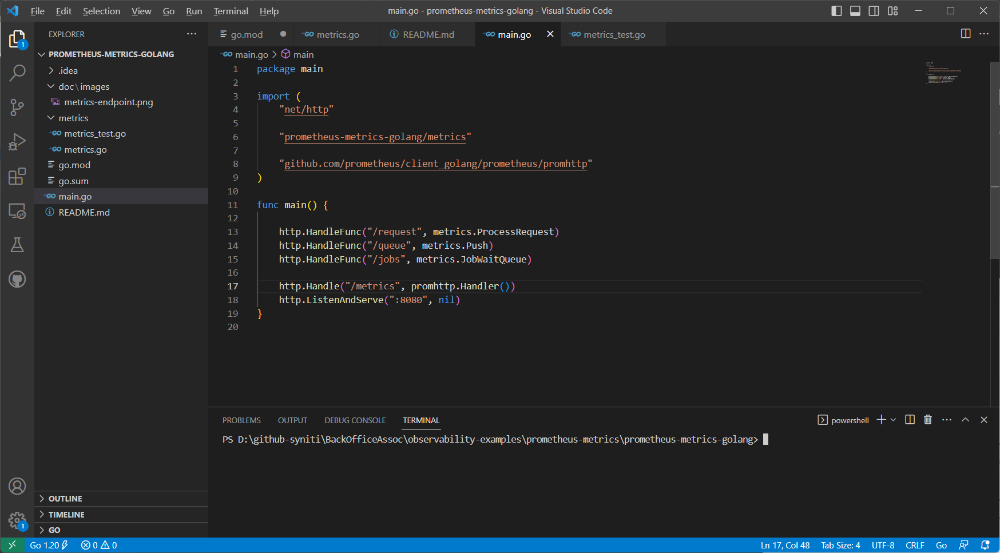
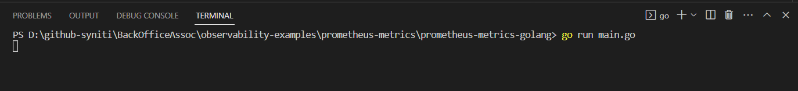
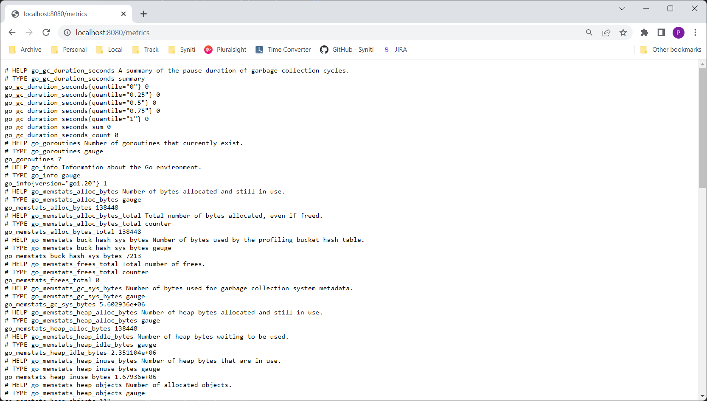
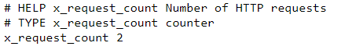
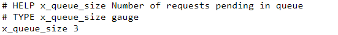
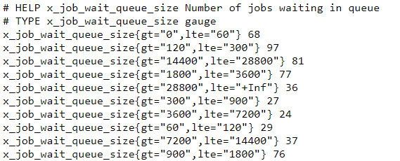

# Prometheus Metrics Code Example for Go

This folder contains [Go](https://go.dev/) code example to create custom [prometheus metrics](https://prometheus.io/docs/concepts/metric_types/). The project uses standard [Prometheus Golang Client Libraries](https://github.com/prometheus/client_golang) for metrics generation.

The Project can be opened in common IDEs like [VS Code](https://code.visualstudio.com/), [IntelliJ IDEA](https://www.jetbrains.com/idea/), [Eclipse](https://www.eclipse.org/)

## Steps

- Open the project in your IDE (Below Example uses VS Code)   
     
- Run application using go command - `go run main.go`   
     
- Once the application start running, access [/metrics](http://localhost:8080/metrics) endpoint of your app in browser to access generated prometheus metrics   
     
- To see counter metrics example, access [/request](http://localhost:8080/request) endpoint in your browser and then refresh [/metrics](http://localhost:8080/metrics). This should generate metrics with name x_request_count   
     
- To see simple gauge metrics example, hit [/queue](http://localhost:8080/queue) in your browser and then refresh [/metrics](http://localhost:8080/metrics). This should generate metrics with name x_queue_size   
     
- To see advanced gauge metrics example, hit [/jobs](http://localhost:8080/jobs) in your browser and then refresh [/metrics](http://localhost:8080/metrics). This should show up set of metrics with name x_job_wait_queue_size   
     
- Code behind the metrics generation can be found in [metrics.go](metrics/metrics.go)